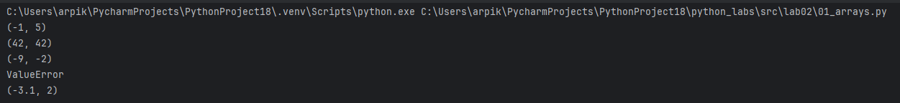
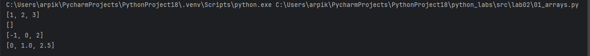
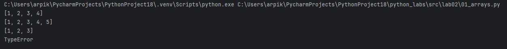
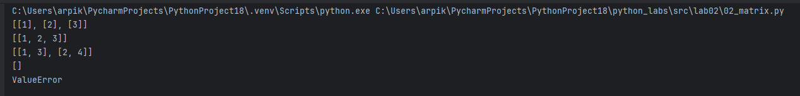
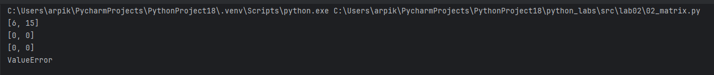
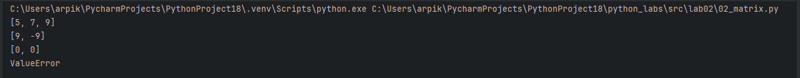
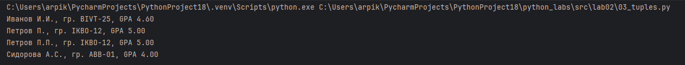

# ЛР2

## Задание 1
```python
def min_max(nums: list[float | int]) -> tuple[float | int, float | int]:
    if not nums:
        raise ValueError
    return (min(nums), max(nums))

print(min_max([3, -1, 5, 5, 0]))
print(min_max([42]))
print(min_max([-5, -2, -9]))
try:
    min_max([])
except ValueError:
    print("ValueError")
print(min_max([1.5, 2, 2.0, -3.1]))
```


```python
def unique_sorted(nums: list[float | int]) -> list[float | int]:
    return sorted(set(nums))

print(unique_sorted([3, 1, 2, 1, 3]))
print(unique_sorted([]))
print(unique_sorted([-1, -1, 0, 2, 2]))
print(unique_sorted([1.0, 1, 2.5, 2.5, 0]))
```


```python
def flatten(mat: list[list | tuple]) -> list:
    result = []
    for row in mat:
        if isinstance(row, (list, tuple)):
            result.extend(row)
        else:
            raise TypeError
    return result

print(flatten([[1, 2], [3, 4]]))
print(flatten([[1, 2], (3, 4, 5)]))
print(flatten([[1], [], [2, 3]]))
try:
    flatten([[1, 2], "ab"])
except TypeError:
    print("TypeError")
```


## Задание 2
```python
def transpose(mat: list[list[float | int]]) -> list[list]:
    if not mat:
        return []
    if not all(len(row) == len(mat[0]) for row in mat):
        raise ValueError
    num_rows = len(mat)
    num_cols = len(mat[0])
    return [[mat[r][c] for r in range(num_rows)] for c in range(num_cols)]

print(transpose([[1, 2, 3]]))
print(transpose([[1], [2], [3]]))
print(transpose([[1, 2], [3, 4]]))
print(transpose([]))
try:
    print(transpose([[1, 2], [3]]))
except ValueError:
    print("ValueError")
print()
```



```python
def row_sums(mat: list[list[float | int]]) -> list[float]:
    if not all(len(row) == len(mat[0]) for row in mat if mat):
        raise ValueError
    return [sum(row) for row in mat]

print(row_sums([[1, 2, 3], [4, 5, 6]]))
print(row_sums([[-1, 1], [10, -10]]))
print(row_sums([[0, 0], [0, 0]]))
try:
    print(row_sums([[1, 2], [3]]))
except ValueError:
    print("ValueError")
print()
```



```python
def col_sums(mat: list[list[float | int]]) -> list[float]:
    if not mat or not all(len(row) == len(mat[0]) for row in mat):
        raise ValueError
    num_cols = len(mat[0])
    return [sum(mat[r][c] for r in range(len(mat))) for c in range(num_cols)]

print(col_sums([[1, 2, 3], [4, 5, 6]]))
print(col_sums([[-1, 1], [10, -10]]))
print(col_sums([[0, 0], [0, 0]]))
try:
    print(col_sums([[1, 2], [3]]))
except ValueError:
    print("ValueError")
```



## Задание 3
```python
def format_record(rec: tuple[str, str, float]) -> str:
    if len(rec) != 3:
        raise TypeError
    fio, group, gpa = rec
    if not isinstance(gpa, float):
        raise TypeError
    fio = fio.strip()
    group = group.strip()
    if not fio:
        raise ValueError
    if not group:
        raise ValueError

    name_parts = [part.strip() for part in fio.split() if part.strip()]
    if len(name_parts) < 2:
        raise ValueError
    surname = name_parts[0].title()
    initials = '.'.join(part[0].upper() for part in name_parts[1:]) + '.'
    formatted_fio = f"{surname} {initials}"

    gpa_formatted = f"{gpa:.2f}"
    return f"{formatted_fio}, гр. {group}, GPA {gpa_formatted}"

print(format_record(("Иванов Иван Иванович", "BIVT-25", 4.6)))
print(format_record(("Петров Пётр", "IKBO-12", 5.0)))
print(format_record(("Петров Пётр Петрович", "IKBO-12", 5.0)))
try:
    print(format_record(("  сидорова  анна   сергеевна ", "ABB-01", 3.999)))
except ValueError:
    print("ValueError")
```


