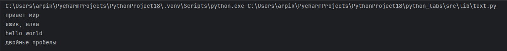
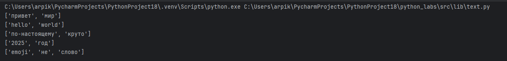
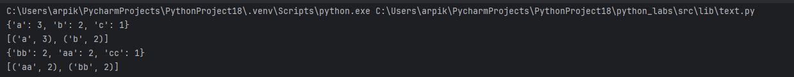
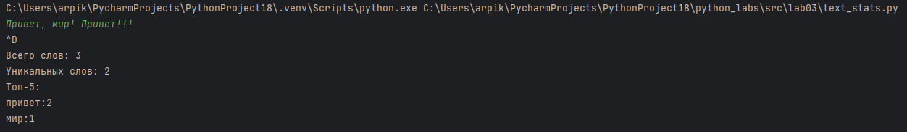

# ЛР3

## Задание A
```python
import re

def normalize(text: str, *, casefold: bool = True, yo2e: bool = True) -> str:
    if casefold:
        text = text.casefold()
    if yo2e:
        text = text.replace('ё', 'е').replace('Ё', 'Е')
    text = re.sub(r'[\t\r\n]', ' ', text)
    text = re.sub(r'\s+', ' ', text).strip()
    return text

print(normalize("ПрИвЕт\nМИр\t"))
print(normalize("ёжик, Ёлка",yo2e=True))
print(normalize("Hello\r\nWorld"))
print(normalize("  двойные   пробелы  "))
```



```python
import re

def tokenize(text: str) -> list[str]:
    return re.findall(r'\w+(?:-\w+)*', text)

print(tokenize("привет мир"))
print(tokenize("hello,world!!!"))
print(tokenize("по-настоящему круто"))
print(tokenize("2025 год"))
print(tokenize("emoji 😀 не слово"))
```



```python
import re

def count_freq(tokens: list[str]) -> dict[str, int]:
    freq = {}
    for token in tokens:
        if token in freq:
            freq[token] += 1
        else:
            freq[token] = 1
    return freq


def top_n(freq: dict[str, int], n: int = 5) -> list[tuple[str, int]]:
    items = list(freq.items())
    items.sort(key=lambda x: (-x[1], x[0]))
    return items[:n]

print(count_freq(["a","b","a","c","b","a"]))
print(top_n(count_freq(["a","b","a","c","b","a"]), 2))
print(count_freq(["bb","aa","bb","aa","cc"]))
print(top_n(count_freq(["bb","aa","bb","aa","cc"]), 2))
```



## Задание B

```python
from python_labs.src.lib.text import normalize, tokenize, count_freq, top_n

text = ''
try:
    while True:
        text += input() + ' '
except EOFError:
    pass

normalized = normalize(text)
tokens = tokenize(normalized)
freq = count_freq(tokens)

total = len(tokens)
unique = len(freq)

print(f"Всего слов: {total}")
print(f"Уникальных слов: {unique}")
print("Топ-5:")
for word, count in top_n(freq, 5):
    print(f"{word}:{count}")
```


