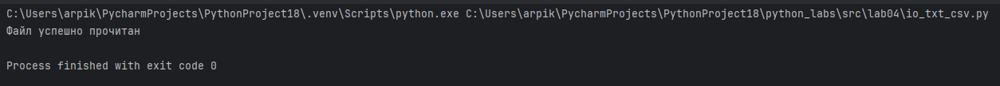
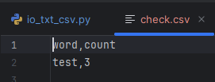
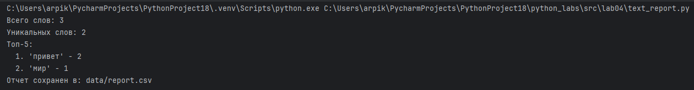
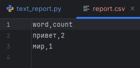

# ЛР4

## Задание A
```python
from pathlib import Path
import csv


def read_text(path: str | Path, encoding: str = "utf-8") -> str:
    path = Path(path)
    with open(path, "r", encoding=encoding) as file:
        return file.read()


def write_csv(
    rows: list[tuple | list], path: str | Path, header: tuple[str, ...] | None = None
) -> None:
    path = Path(path)
    ensure_parent_dir(path)
    if rows:
        first_row_length = len(rows[0])
        for i, row in enumerate(rows):
            if len(row) != first_row_length:
                raise ValueError(
                    f"Строка {i} имеет длину {len(row)}, ожидается {first_row_length}"
                )

    with open(path, "w", newline="", encoding="utf-8") as file:
        writer = csv.writer(file)
        if header is not None:
            writer.writerow(header)
        writer.writerows(rows)


def ensure_parent_dir(path: str | Path) -> None:
    path = Path(path)
    parent_dir = path.parent
    parent_dir.mkdir(parents=True, exist_ok=True)


if __name__ == "__main__":

    from io_txt_csv import read_text, write_csv

    write_csv([("word", "count"), ("test", 3)], "data/check.csv")
    try:
        txt = read_text("test_input.txt")
        print("Файл успешно прочитан")
    except FileNotFoundError:
        print("Файл test_input.txt не найден")
    except UnicodeDecodeError:
        print("Ошибка кодировки при чтении файла")
```




## Задание B
```python
import sys
import argparse
from pathlib import Path

from io_txt_csv import read_text, write_csv
from python_labs.src.lib.text import normalize, tokenize, count_freq, top_n


def generate_report(input_path: str, output_path: str, encoding: str = "utf-8") -> None:

    try:
        text = read_text(input_path, encoding)
    except FileNotFoundError:
        print(f"Ошибка: файл '{input_path}' не найден")
        sys.exit(1)
    except UnicodeDecodeError as e:
        print(f"Ошибка кодировки: {e}")
        print("Попробуйте указать другую кодировку с помощью --encoding")
        sys.exit(1)

    normalized_text = normalize(text, casefold=True, yo2e=True)
    tokens = tokenize(normalized_text)
    frequencies = count_freq(tokens)
    sorted_words = sorted(frequencies.items(), key=lambda x: (-x[1], x[0]))

    header = ("word", "count")
    write_csv(sorted_words, output_path, header)
    total_words = len(tokens)
    unique_words = len(frequencies)

    print(f"Всего слов: {total_words}")
    print(f"Уникальных слов: {unique_words}")

    if unique_words > 0:
        top_5_words = top_n(frequencies, 5)
        print("Топ-5:")
        for i, (word, count) in enumerate(top_5_words, 1):
            print(f"  {i}. '{word}' - {count}")
    else:
        print("Топ-5: нет данных")

    print(f"Отчет сохранен в: {output_path}")


def main():
    parser = argparse.ArgumentParser(
        description="Генератор отчета по частотности слов в тексте"
    )
    parser.add_argument(
        "--in",
        dest="input_file",
        default="test_input.txt",
    )
    parser.add_argument(
        "--out",
        dest="output_file",
        default="data/report.csv",
    )
    parser.add_argument(
        "--encoding",
        default="utf-8",
    )

    args = parser.parse_args()
    generate_report(args.input_file, args.output_file, args.encoding)


if __name__ == "__main__":
    main()
```




