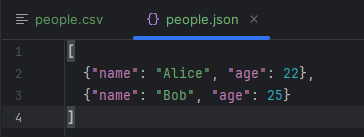
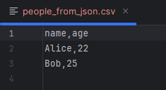
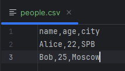
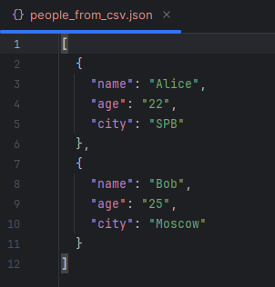
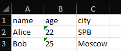

# ЛР5

## Задание A
```python
import json
import csv
from pathlib import Path


def json_to_csv(json_path: str, csv_path: str) -> None:
    """
    Преобразует JSON-файл в CSV.
    Поддерживает список словарей [{...}, {...}], заполняет отсутствующие поля пустыми строками.
    Кодировка UTF-8.
    Порядок колонок — как в первом объекте, дополнительные — в алфавитном порядке.
    """
    json_file = Path(json_path)
    csv_file = Path(csv_path)

    if not json_file.is_file():
        raise FileNotFoundError(f"JSON файл не найден: {json_path}")

    with json_file.open("r", encoding="utf-8") as f:
        try:
            data = json.load(f)
        except json.JSONDecodeError as e:
            raise ValueError(f"Ошибка чтения JSON: {e}")

    if not data or not isinstance(data, list):
        raise ValueError(
            "Пустой JSON или неподдерживаемая структура: ожидается список словарей."
        )
    if not all(isinstance(item, dict) for item in data):
        raise ValueError("Все элементы JSON должны быть словарями.")

    first_keys = list(data[0].keys())
    all_keys = set(first_keys)
    for item in data[1:]:
        all_keys.update(item.keys())
    additional_keys = sorted(all_keys - set(first_keys))
    fieldnames = first_keys + additional_keys

    with csv_file.open("w", encoding="utf-8", newline="") as f:
        writer = csv.DictWriter(f, fieldnames=fieldnames)
        writer.writeheader()
        for item in data:
            row = {key: item.get(key, "") for key in fieldnames}
            writer.writerow(row)


json_to_csv(f"C:/Users/arpik/PycharmProjects/PythonProject18/python_labs/data/lab05/samples/people.json", f"C:/Users/arpik/PycharmProjects/PythonProject18/python_labs/data/lab05/out/people_from_json.csv")


def csv_to_json(csv_path: str, json_path: str) -> None:
    """
    Преобразует CSV в JSON (список словарей).
    Заголовок обязателен, значения сохраняются как строки.
    json.dump(..., ensure_ascii=False, indent=2)
    """
    csv_file = Path(csv_path)
    json_file = Path(json_path)

    if not csv_file.is_file():
        raise FileNotFoundError(f"CSV файл не найден: {csv_path}")

    with csv_file.open("r", encoding="utf-8", newline="") as f:
        reader = csv.DictReader(f)
        if reader.fieldnames is None:
            raise ValueError("CSV файл не содержит заголовка.")
        data = list(reader)

    if not data:
        raise ValueError("CSV файл пуст.")

    with json_file.open("w", encoding="utf-8") as f:
        json.dump(data, f, ensure_ascii=False, indent=2)


csv_to_json(f"C:/Users/arpik/PycharmProjects/PythonProject18/python_labs/data/lab05/samples/people.csv", f"C:/Users/arpik/PycharmProjects/PythonProject18/python_labs/data/lab05/out/people_from_csv.json")
```







## Задание B
```python
from openpyxl import Workbook
import csv
from pathlib import Path


def csv_to_xlsx(csv_path: str, xlsx_path: str) -> None:
    """
    Конвертирует CSV в XLSX.
    Использует openpyxl.
    Первая строка CSV — заголовок.
    Лист называется "Sheet1".
    Колонки — автоширина по длине текста (не менее 8 символов).
    """
    csv_file = Path(csv_path)
    xlsx_file = Path(xlsx_path)

    if not csv_file.is_file():
        raise FileNotFoundError(f"CSV файл не найден: {csv_path}")

    wb = Workbook()
    ws = wb.active
    ws.title = "Sheet1"

    with csv_file.open("r", encoding="utf-8", newline="") as f:
        reader = csv.reader(f)
        rows = list(reader)

    if not rows:
        raise ValueError("CSV файл пустой")

    for row in rows:
        ws.append(row)

    for col_idx, col_cells in enumerate(ws.columns, start=1):
        max_length = max(
            len(str(cell.value)) if cell.value is not None else 0 for cell in col_cells
        )
        adjusted_width = max(max_length, 8)
        col_letter = ws.cell(row=1, column=col_idx).column_letter
        ws.column_dimensions[col_letter].width = adjusted_width

    wb.save(xlsx_file)


csv_to_xlsx('C:/Users/arpik/PycharmProjects/PythonProject18/python_labs/data/lab05/samples/people.csv', 'C:/Users/arpik/PycharmProjects/PythonProject18/python_labs/data/lab05/out/people.xlsx')
```



