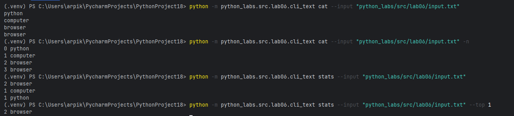
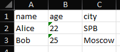
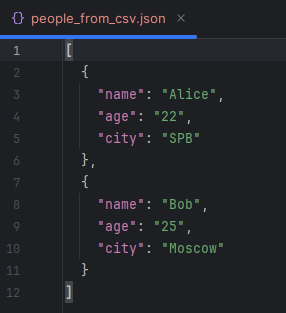
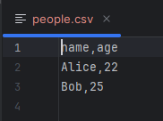

# ЛР6

## Задание 1
```python
import  argparse
from python_labs.src.lib.text import *

def cat(text, n):
    f = open(text, "r").readlines()
    if not n:
        for i in f:
            print(i.replace("\n", ""))
    else:
        f = enumerate(f)
        for i in f:
            print(i[0],i[1].replace("\n", ""))


def stats(txt,n):
    f = open(txt, "r").read()
    txt = top_n(count_freq(tokenize(normalize(f))),n)
    for a in txt:
        print(a[1],a[0])


# def main():
parser = argparse.ArgumentParser("CLI‑утилиты лабораторной №6")
subparsers = parser.add_subparsers(dest="command")

# подкоманда cat
cat_parser = subparsers.add_parser("cat",help = "Вывести содержимое файла")
cat_parser.add_argument("--input",required = True)
cat_parser.add_argument("-n", action="store_true",help = "Нумировать строки")

# подкоманда stats
stats_parser = subparsers.add_parser("stats",help = "Частоты слез")
stats_parser.add_argument("--input",required = True)
stats_parser.add_argument("--top",type = int, default = 5)

args = parser.parse_args()
# print("DEBUG:", args)

if args.command == "cat":
    cat(args.input,args.n)

if args.command == "stats":
    stats(args.input,args.top)
```




## Задание 2
```python
import argparse
from python_labs.src.lab05.csv_xlsx import csv_to_xlsx
from python_labs.src.lab05.json_csv import json_to_csv, csv_to_json


parser = argparse.ArgumentParser("CLI‑утилиты лабораторной №6")
subparsers = parser.add_subparsers(dest="command")

json2csv_parser = subparsers.add_parser("json2csv",help = "Первевести json в csv")
json2csv_parser.add_argument("--in",required=True,dest='input')
json2csv_parser.add_argument("--out",required=True)

csv2json_parser = subparsers.add_parser("csv2json", help = "Перевести csv в json")
csv2json_parser.add_argument("--in",required=True,dest='input')
csv2json_parser.add_argument("--out",required=True)

csv2xlsx_parser = subparsers.add_parser("csv2xlsx",help = "Первевести csv в xlsx")
csv2xlsx_parser.add_argument("--in",required=True,dest='input')
csv2xlsx_parser.add_argument("--out",required=True)

args = parser.parse_args()

if args.command == "json2csv":
    json_to_csv(args.input,args.out)
if args.command == "csv2json":
    csv_to_json(args.input,args.out)
if args.command == "csv2xlsx":
    csv_to_xlsx(args.input,args.out)

```

```python
python -m python_labs.src.lab06.cli_convert csv2xlsx --in "python_labs/data/lab05/samples/people.csv" --out "python_labs/data/lab06/out/people.xlsx"
```


```python
python -m python_labs.src.lab06.cli_convert csv2json --in "python_labs/data/lab05/samples/people.csv" --out "python_labs/data/lab06/out/people_from_csv.json"
```


```python
python -m python_labs.src.lab06.cli_convert json2csv --in "python_labs/data/lab05/samples/people.json" --out "python_labs/data/lab06/out/people.csv"
```
