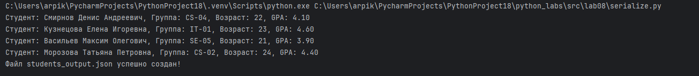
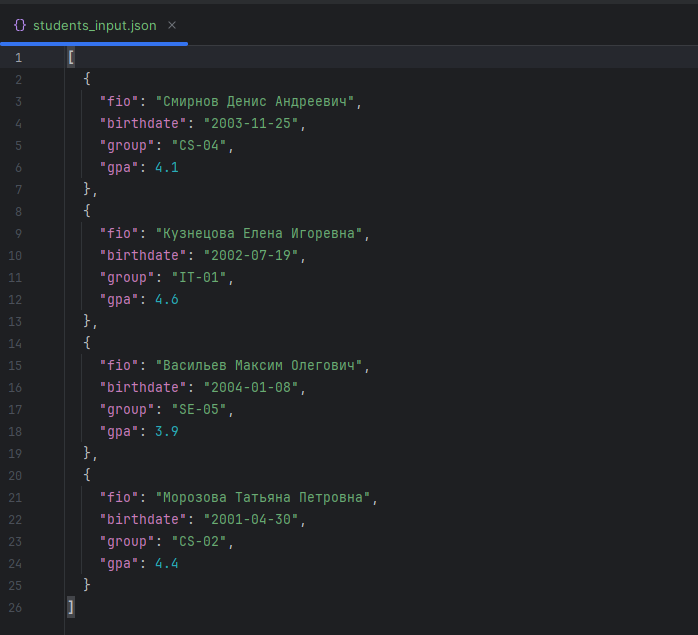
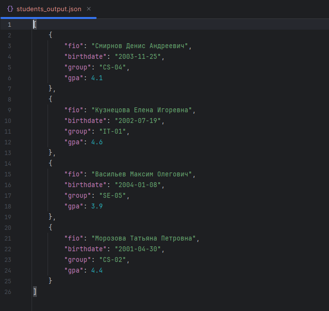

# ЛР8

## Задание 1
```python
from dataclasses import dataclass
from datetime import datetime
from typing import Dict, Any


@dataclass
class Student:
    fio: str
    birthdate: str  # формат YYYY-MM-DD
    group: str
    gpa: float

    def __post_init__(self):
        # Валидация формата даты
        try:
            datetime.strptime(self.birthdate, "%Y-%m-%d")
        except ValueError:
            raise ValueError("Некорректный формат даты рождения. Ожидается YYYY-MM-DD.")

        # Валидация диапазона GPA
        if not (0.0 <= self.gpa <= 5.0):
            raise ValueError("GPA должен быть в диапазоне от 0.0 до 5.0.")

    def age(self) -> int:
        """Возвращает количество полных лет."""
        today = datetime.today()
        birth = datetime.strptime(self.birthdate, "%Y-%m-%d")
        age = today.year - birth.year
        if (today.month, today.day) < (birth.month, birth.day):
            age -= 1
        return age

    def to_dict(self) -> Dict[str, Any]:
        """Сериализация объекта в словарь."""
        return {
            "fio": self.fio,
            "birthdate": self.birthdate,
            "group": self.group,
            "gpa": self.gpa,
        }

    @classmethod
    def from_dict(cls, data: Dict[str, Any]) -> "Student":
        """Десериализация: создаёт объект из словаря."""
        return cls(**data)

    def __str__(self) -> str:
        return f"Студент: {self.fio}, Группа: {self.group}, Возраст: {self.age()}, GPA: {self.gpa:.2f}"
```


## Задание 2
```python
import json
from pathlib import Path
from typing import List
from python_labs.src.lab08.models import Student


def students_to_json(students: List[Student], path: str) -> None:
    """Сохраняет список студентов в JSON-файл."""
    with open(path, "w", encoding="utf-8") as f:
        json.dump([s.to_dict() for s in students], f, ensure_ascii=False, indent=4)


def students_from_json(path: str) -> List[Student]:
    """Читает JSON-файл и возвращает список объектов Student."""
    file_path = Path(path)
    if not file_path.exists():
        raise FileNotFoundError(f"Файл не найден: {path}")

    with open(file_path, "r", encoding="utf-8") as f:
        try:
            data = json.load(f)
        except json.JSONDecodeError as e:
            raise ValueError(f"Ошибка при разборе JSON: {e}")

    if not isinstance(data, list):
        raise ValueError("Ожидался JSON-массив.")

    students = []
    for item in data:
        if not isinstance(item, dict):
            raise ValueError("Каждый элемент массива должен быть объектом.")
        students.append(Student.from_dict(item))

    return students


students = students_from_json("C:/Users/arpik/PycharmProjects/PythonProject18/python_labs/data/lab08/samples/students_input.json")


for s in students:
    print(s)

students_to_json(students, "C:/Users/arpik/PycharmProjects/PythonProject18/python_labs/data/lab08/out/students_output.json")
print("Файл students_output.json успешно создан!")
```



