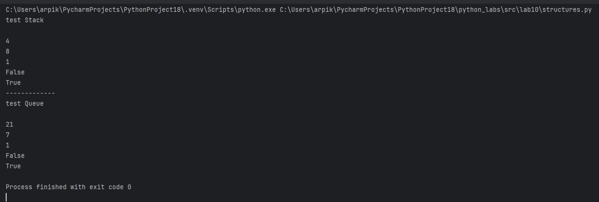
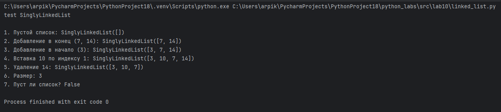

# ЛР10
# **Теория**

**Stack** - стопка, как стопка тарелок.
Можно положить элемент сверху, взять верхний или посмотреть верхний и положить обратно.
Методы:

* `push` - положить элемент сверху
* `pop` - взять верхний элемент
* `peek` - посмотреть верхний элемент

**Queue** - очередь.
В неё можно встать, посмотреть первого в очереди или выйти из очереди.
Методы:

* `enqueue` - добавить элемент в конец очереди
* `dequeue` - убрать первый элемент
* `peek` - посмотреть первый элемент

**Singly Linked List** - связный список, как цепочка людей, где каждый знает только следующего.
Чтобы дойти до нужного человека, нужно идти по цепочке один за другим.
Методы:

* `insert` - добавить элемент в список
* `delete` - удалить элемент из списка
* `search` - найти элемент в списке

  
## Задание 1
```python
from collections import deque


class Stack:
    """Стек (LIFO) на основе списка."""

    def __init__(self, data: list = []):
        """Создаёт стек.
        data - список, в котором хранятся элементы стека.
        """
        self._data = data

    def push(self, item):
        """Добавить элемент на вершину стека."""
        self._data.append(item)

    def pop(self):
        """Снять и вернуть верхний элемент стека."""
        return self._data.pop()

    def peek(self):
        """Вернуть верхний элемент без удаления."""
        return self._data[-1]

    def is_empty(self):
        """Проверить, пуст ли стек."""
        return len(self._data) == 0

    def __len__(self):
        """Вернуть количество элементов в стеке."""
        return len(self._data)


class Queue:
    """Очередь на основе deque."""

    def __init__(self, data: deque = []):
        """Создаёт очередь.
        data - deque, в котором хранятся элементы очереди.
        """
        self._data = data

    def enqueue(self, item):
        """Добавить элемент в очередь."""
        self._data.append(item)

    def dequeue(self):
        """Удалить и вернуть элемент из очереди.
        Если очередь пуста - выбрасывает IndexError.
        """
        if self._data == []:
            raise IndexError("Queue is empty")
        else:
            return self._data.pop()

    def peek(self):
        """Вернуть элемент очереди без удаления.
        Если очередь пуста - вернуть None.
        """
        if self._data == []:
            return None
        return self._data[-1]

    def is_empty(self):
        """Проверить, пуста ли очередь."""
        if self._data == []:
            return True
        else:
            return False

    def __len__(self):
        """Вернуть количество элементов в очереди."""
        return len(self._data)


# test Stack
print("test Stack\n")
s = Stack([])                  # создание пустого стека
s.push(8)                      # добавляем 8 в стек
s.push(4)                      # добавляем 4 поверх 8
print(s.pop())                 # удаляем и выводим верхний элемент (4)
print(s.peek())                # смотрим верхний элемент (8)
print(s.__len__())             # выводим количество элементов в стеке
print(s.is_empty())            # проверяем, пуст ли стек
s.pop()                        # удаляем последний элемент (8)
print(s.is_empty())            # проверяем, пуст ли стек после удаления

print("-------------")

# test Queue
print("test Queue\n")
q = Queue()                    # создание пустой очереди
q.enqueue(7)                   # добавляем 7 в очередь
q.enqueue(21)                  # добавляем 21 в очередь
print(q.dequeue())             # удаляем и выводим элемент из очереди
print(q.peek())                # смотрим элемент очереди без удаления
print(q.__len__())             # выводим количество элементов в очереди
print(q.is_empty())            # проверяем, пуста ли очередь
q.dequeue()                    # удаляем последний элемент очереди
print(q.is_empty())            # проверяем, пуста ли очередь после удаления


```



## Задание 2
```python
class Node:
    """Узел односвязного списка."""

    def __init__(self, value, next=None):
        """
        value - значение, хранящееся в узле
        next - ссылка на следующий узел или None
        """
        self.value = value
        self.next = next

    def __repr__(self):
        """Удобное представление узла для отладки."""
        return f"Node({self.value})"


class SinglyLinkedList:
    """Односвязный список."""

    def __init__(self):
        """Создаёт пустой список."""
        self.head = None   # первый элемент списка
        self.tail = None   # последний элемент списка
        self._size = 0     # количество элементов

    def append(self, value):
        """Добавить элемент в конец списка."""
        new_node = Node(value)

        # Если список пуст
        if self.head is None:
            self.head = new_node
            self.tail = new_node
        else:
            # Привязываем новый узел к текущему хвосту
            self.tail.next = new_node
            self.tail = new_node

        self._size += 1

    def prepend(self, value):
        """Добавить элемент в начало списка."""
        new_node = Node(value, next=self.head)
        self.head = new_node

        # Если список был пуст
        if self.tail is None:
            self.tail = new_node

        self._size += 1

    def insert(self, idx, value):
        """Вставить элемент по индексу idx."""
        if idx < 0 or idx > self._size:
            raise IndexError(f"Index {idx} out of bounds for size {self._size}")

        # Вставка в начало
        if idx == 0:
            self.prepend(value)
            return

        # Вставка в конец
        if idx == self._size:
            self.append(value)
            return

        # Поиск узла перед нужной позицией
        cur = self.head
        for _ in range(idx - 1):
            cur = cur.next

        new_node = Node(value, next=cur.next)
        cur.next = new_node
        self._size += 1

    def remove(self, value):
        """Удалить первый элемент со значением value."""
        if self.head is None:
            raise ValueError(f"{value} not in list")

        # Если удаляем голову
        if self.head.value == value:
            self.head = self.head.next
            if self.head is None:
                self.tail = None
            self._size -= 1
            return

        cur = self.head
        while cur.next is not None:
            if cur.next.value == value:
                # Если удаляем хвост
                if cur.next == self.tail:
                    self.tail = cur

                cur.next = cur.next.next
                self._size -= 1
                return
            cur = cur.next

        raise ValueError(f"{value} not in list")

    def __len__(self):
        """Вернуть количество элементов в списке."""
        return self._size

    def __iter__(self):
        """Итерация по значениям списка от головы к хвосту."""
        cur = self.head
        while cur is not None:
            yield cur.value
            cur = cur.next

    def __repr__(self):
        """Строковое представление списка."""
        values = list(self)
        return f"SinglyLinkedList({values})"


# test SinglyLinkedList
print("test SinglyLinkedList")
print()

sll = SinglyLinkedList()
print(f"1. Пустой список: {sll}")

sll.append(7)
sll.append(14)
print(f"2. Добавление в конец (7, 14): {sll}")

sll.prepend(3)
print(f"3. Добавление в начало (3): {sll}")

sll.insert(1, 10)
print(f"4. Вставка 10 по индексу 1: {sll}")

sll.remove(14)
print(f"5. Удаление 14: {sll}")

print(f"6. Размер: {len(sll)}")
print(f"7. Пуст ли список? {len(sll) == 0}")

```


